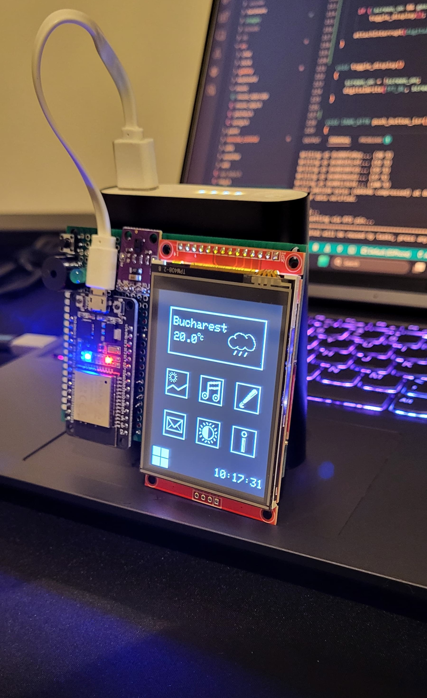
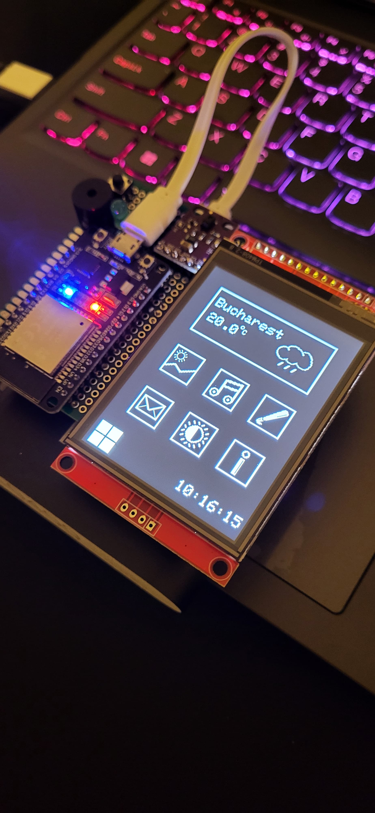
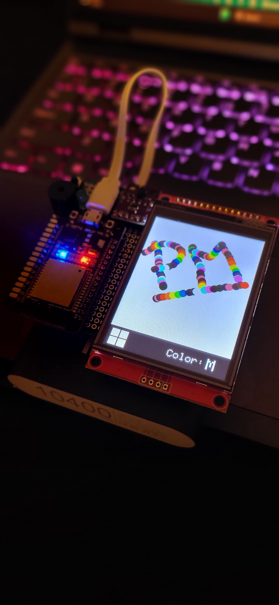
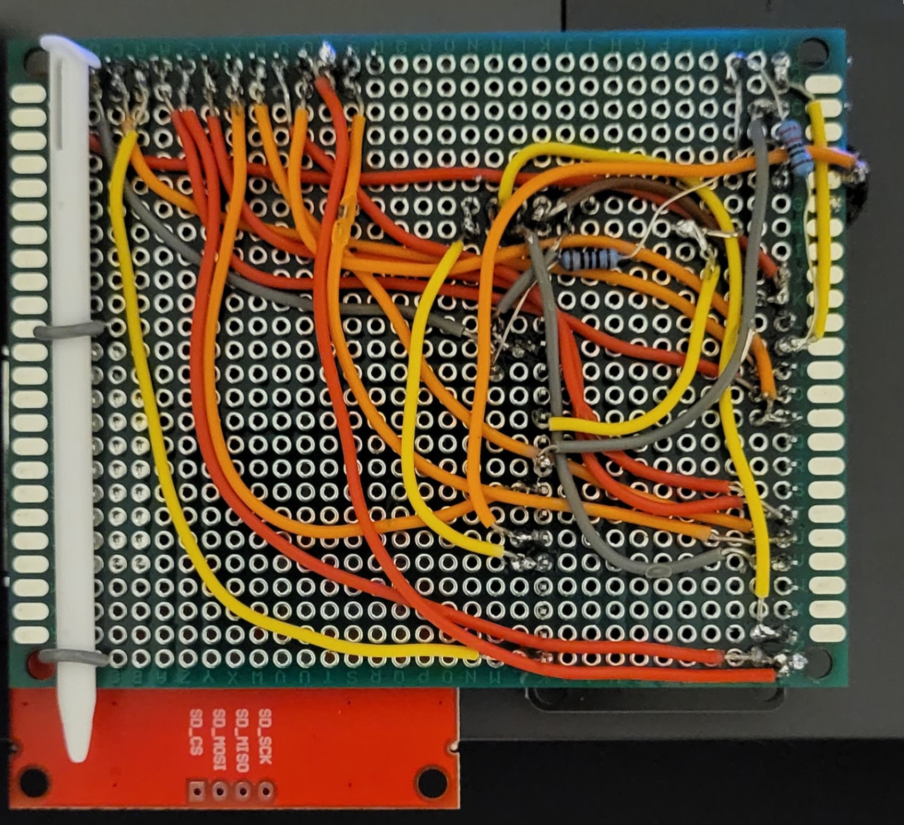

# ESPhone

### Autor: Popescu Cristian-Emanuel 332CA

## Diagramă bloc

## About

+ ESPhone este un telefon low-cost și low-power, potrivit pentru cei care au nevoie doar de aplicațiile de bază ale unui telefon.
+ Scopul proiectului este asamblarea și interconectarea unor componente electronice, care să ofere utilizatorului un telefon pentru uz de strictă necesitate. Astfel, ESPhone va pune la dispoziție următoarele funcționalități esențiale: galerie foto, redare muzică, aplicație de desenat, mesagerie, timpul curent si cel mai important, vremea.
+ Ideea de bază a fost dorința de a agrega funcționalitățile primitive ale telefoanelor actuale - precum galeria foto, redarea muzicii, vreme, alarma, etc. - într-un dispozitiv construit de la 0.
+ Proiectul este util, deoarece relevă multitudinea de aplicații redundante si timpul pierdut cu acestea, în timp ce ESPhone oferă utilizatorului strictul necesar din punct de vedere software, ajutându-l să se concentreze pe lucrurile cu adevărat importante.

## Descriere hardware

**TFT LCD 2.8" 240x320**
  * Ecranul va fi folosit pentru afișarea aplicațiilor și conținutului.
  * Funcția capacitivă a modulului permite utilizatorului sa navigheze prin aplicații și să controleze anumite funcționalități ale acestora.

| Pin | Pin ESP32 | Descriere |
| --- | --------- | --------- |
| VCC | 3V3 | Alimentare ecran |
| GND | GND | GND pentru ecran |
| CS | GPIO15 | Slave select ecran|
| RESET | EN | Resetează ecranul |
| DC | GPIO2 | Controlează tipul de date transmise prin SPI |
| MOSI | GPIO23 | MOSI pentru ecran |
| SCK | GPIO18 | SCK pentru ecran |
| LED | GPIO25 | Controlează luminozitatea ecranului |
| MISO | GPIO19 | MISO pentru ecran |
| T_CLK | GPIO18 | SCK pentru touch |
| T_CS | GPIO4 | Slave select touch |
| T_DIN | GPIO23 | MOSI pentru touch |
| T_DO | GPIO19 | MISO pentru touch  |

**Senzor APDS-9960**
  * Senzorul de gesturi va fi folosit pentru controlul dispozitivului de la distanță.

| Pin | Pin ESP32 | Descriere |
| --- | --------- | --------- |
| VCC | 3V3 | Alimentare senzor |
| GND | GND | GND pentru senzor |
| SDA | GPIO21 | Linia de date pentru senzor |
| SCL | GPIO22 | Semnal de clock pentru senzor |
| INT | GPIO35 | Pin ce generează întreruperi |

**Buzzer pasiv**
  * Buzzer-ul va fi legat la GPIO32 al microcontrollerului ESP32. Acesta va fi folosit în aplicația de redare a muzicii. De asemenea, este legat in serie cu o rezistență de 100 Ohm pentru a preveni zgomotele ascuțite.

**Push Button**
  * Acest buton va fi legat la pinul GPIO26 al ESP32 in configurație de INPUT_PULLUP. Acesta are mai multe funcționalități, in funcție de aplicația curentă:

| Aplicația curentă | Funcție |
| ----------------- | ------- |
| Home | Închide ecranul pentru economisirea energiei |
| Paint | Resetează canvas-ul |
| Music | Iese din aplicația de redare a muzicii |

**Green LED**
  * LED-ul va fi legat la GPIO14 al microcontrollerului ESP32. Acesta va fi controlat cu un semnal PWM  pentru a indica starea de idle a ESP32.
  * Starea de idle se activează în momentul când utilizatorul închide ecranul.

## Bill of Materials
| Piesă                | Datasheet Link                                                                                                                                  | Buy Link |
|----------------------|--------------------------------------------------------------------------------------------------------------------------------------------------|----------|
| ESP32 DevKit-V1      | [Datasheet](https://docs.espressif.com/projects/esp-dev-kits/en/latest/esp32/esp-dev-kits-en-master-esp32.pdf)                                 | [Buy](https://www.optimusdigital.ro/en/bluetooth-boards/4371-esp32-development-board-with-wifi-and-bluetooth-42.html?search_query=0104110000035783&results=1) |
| TFT LCD 2.8" 240x320 | [Datasheet](http://www.lcdwiki.com/res/MSP2807/ILI9341%20Datasheet.pdf)                                                                         | [Buy](https://www.aliexpress.com/item/1005006623369442.html?spm=a2g0o.order_list.order_list_main.10.66c21802sxSL3W) |
| APDS-9960 Sensor     | [Datasheet](https://cdn.sparkfun.com/assets/learn_tutorials/3/2/1/Avago-APDS-9960-datasheet.pdf)                                                | [Buy](https://www.optimusdigital.ro/en/others/4471-senzor-de-gesturi-rgb-apds-9960.html?search_query=0104110000016386&results=1) |
| Passive Buzzer       | [Datasheet](https://www.farnell.com/datasheets/2171929.pdf)                                                                                     | [Buy](https://www.optimusdigital.ro/en/kits/12026-plusivo-electronics-starter-kit-0721248990075.html?search_query=X0019AJD65&results=1) |
| Push Button          | [Datasheet](https://www.farnell.com/datasheets/2617271.pdf)                                                                                     | [Buy](https://www.optimusdigital.ro/en/kits/12026-plusivo-electronics-starter-kit-0721248990075.html?search_query=X0019AJD65&results=1) |
| LED                  | [Datasheet](https://www.farnell.com/datasheets/2724776.pdf)                                                                                     | [Buy](https://www.optimusdigital.ro/en/kits/12026-plusivo-electronics-starter-kit-0721248990075.html?search_query=X0019AJD65&results=1) |
| Resistor 330 Ohm     | [Datasheet](https://protosupplies.com/product/resistor-330-5/)                                                                                  | [Buy](https://www.optimusdigital.ro/en/kits/12026-plusivo-electronics-starter-kit-0721248990075.html?search_query=X0019AJD65&results=1) |
| Resistor 100 Ohm     | [Datasheet](https://www.mouser.com/datasheet/2/414/GP-1671375.pdf?srsltid=AfmBOooEAvJOJrYeo7V_zuZGEGqLsuIyJnjLsqryeTPISK3ep1z37LnL)             | [Buy](https://www.optimusdigital.ro/en/kits/12026-plusivo-electronics-starter-kit-0721248990075.html?search_query=X0019AJD65&results=1) |
| Power Bank 10400mAh  | -                                                                                                                                                | [Buy](https://www.emag.ro/power-bank-de-aluminiu-10400-mah-negru-2173/pd/DNSD9QMBM/?cmpid=146866&utm_source=google&utm_medium=cpc&utm_campaign=(RO:eMAG!)_3P_NO_SALES_%3e_Telefoane_mobile_and_accesorii&utm_content=144212673726&gad_source=1&gad_campaignid=2087836549&gbraid=0AAAAACvmxQgCiHriGz53DC2mKGd2rP0Ic&gclid=CjwKCAjwi-DBBhA5EiwAXOHsGXxQQ609BvhfPWVwNBM_i8d4rfWvsmEZHABBTvTVGSw-Sb8EC28i8BoCQkEQAvD_BwE) |
| Rigid Wires          | -                                                                                                                                                | [Buy](https://www.optimusdigital.ro/ro/fire-fire-nemufate/899-set-de-fire-pentru-breadboard-rigide.html?search_query=0104110000008046&results=1) |
| Placă de test        | -      

## Images

